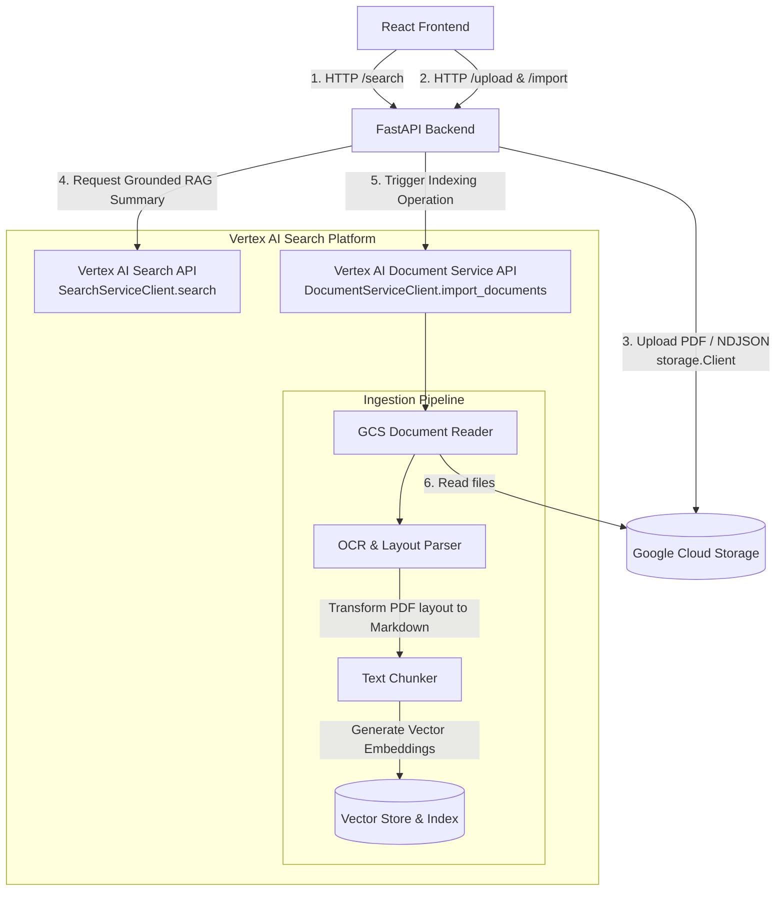

# Project Notes & Context

## Codelab Reference
This repository is used in the following Google Codelab:
* **Title:** Building a Google-quality Search System with Vertex AI
* **URL:** https://codelabs.developers.google.com/build-google-quality-rag

---

## Architecture Overview

This project implements a Retrieval-Augmented Generation (RAG) search application. The application itself is lightweight (a "thin client/server") and offloads the core machine learning, search, and generation steps to Google Cloud Services.



### Search API Response Schema (RAG Return JSON)
When the backend requests a grounded summary, the response JSON returned from `SearchServiceClient.search` contains distinct metadata blocks. Here is a concise representation showing how the generative summary, cited references, and raw extractive chunks are returned:

```json
{
  "summary": {
    "summaryText": "Coley's toxins led to complete tumor regression in Case 67.",
    "summaryWithMetadata": {
      "references": [
        {
          "chunkContents": [
            {
              "pageIdentifier": "12",
              "content": "* **Case 67 (BURKE):** ... Complete regression of tumor."
            }
          ]
        }
      ]
    }
  },
  "results": [
    {
      "document": {
        "derivedStructData": {
          "title": "docs/sarcoma_report.pdf",
          "snippets": [
            { "snippet": "Coley's <b>toxins</b> treatment..." }
          ],
          "extractive_segments": [
            {
              "pageNumber": "12",
              "content": "DISCUSSION: It now seems opportune to review...",
              "relevanceScore": 0.69
            }
          ]
        }
      }
    }
  ]
}
```

### Core Components
1. **React Frontend**: A web application that handles user authentication, exposes configuration sliders (such as `pageSize`, `summaryResultCount`, and `maxSnippetCount`), and displays search summaries and document citations.
2. **FastAPI Backend**: A lightweight Python proxy server that handles authentication validation, static file serving, and acts as an intermediary for Google Cloud client libraries.
3. **Google Cloud Storage (GCS)**: Stores the raw PDF documents and JSON (NDJSON) metadata manifests.
4. **Vertex AI Search (Agent Builder)**: Indexes the GCS bucket documents, manages the vector space, and orchestrates semantic retrieval and grounded summary generation.

### Key Architecture Clarifications
* **No Direct LLM Integration**: The codebase does not import or call any LLM APIs (like the Gemini API or standard Vertex AI Generative AI SDKs) directly. Instead, it delegates LLM synthesis to Vertex AI Search by requesting summaries via the API's `summary_spec` payload parameter.
* **No Programmatic Resource Creation**: The application does not programmatically create search agents or datastores. It expects these resources to be pre-configured in the Google Cloud Console, and interacts with them using their configured resource IDs (`DATASTORE_ID` and `AGENT_APPLICATION_ID`).

### Hosting & Web Server Nuances
* **Unified Web Server**: Rather than running separate servers for frontend and backend (e.g., Nginx + Gunicorn), this project consolidates both roles into a single **FastAPI process** (running on Uvicorn ASGI server). It serves two main functions:
  * **Static Web Server**: Serves compiled React assets (HTML, JS, CSS) to the client's browser from `/app/backend/app/static/` via `FastAPI`'s `StaticFiles` mounting.
  * **API Application Server**: Processes REST endpoints (`/search`, `/upload`, `/datastore/import`) and acts as a gateway to Google Cloud.
* **Client-Side Execution**: The compiled React code is downloaded by the client's browser once and interpreted/executed entirely locally on the user's computer. Subsequent user interactions (typing, panel sliders) run client-side. The UI only queries the web server via asynchronous HTTP API calls (via [backend.js](file:///Users/ctwins/Documents/code/study/vertex-ai-search-agent-builder-demo/frontend/src/api/backend.js)) when triggering a search or uploading documents.
* **Cloud Run Autoscaling**: In production, the single container image is deployed to Google Cloud Run. Cloud Run dynamically provisions instances based on traffic:
  * **Scale-to-Zero**: Shrinks to 0 active instances when there is no incoming traffic to eliminate idle costs.
  * **Autoscale (1 to N)**: Provisions one or more container instances dynamically as request traffic spikes. Each container instance runs exactly one Python process (`fastapi run main.py`).

---

## Setup & Local Testing

### Backend Setup (Python)
The backend Python virtual environment is successfully created and configured.
* **Interpreter path:** `backend/venv/bin/python`
* **Dependencies:** `google-cloud-discoveryengine`, `google-cloud-storage`, `fastapi`, `coloredlogs`, `python-multipart`

To run the backend locally:
```sh
cd backend
source venv/bin/activate
uvicorn main:app --reload
```

### Frontend Setup (Node.js)
Frontend dependencies are successfully installed.

To run the frontend locally:
```sh
cd frontend
npm run start
```

---

## Google Cloud / Vertex AI APIs Used

The backend leverages the official Google Cloud SDKs to call these primary APIs:

### 1. Vertex AI Discovery Engine API (Search)
* **Client**: `discoveryengine.SearchServiceClient`
* **Method**: `client.search()` (used in [search_discovery_engine](file:///Users/ctwins/Documents/code/study/vertex-ai-search-agent-builder-demo/backend/search.py#L13))
* **Function**: Executes the semantic search query against the target Datastore. The API retrieves relevant segments, extracts exact answers, and generates grounded generative summaries with inline citations.

### 2. Vertex AI Discovery Engine API (Documents)
* **Client**: `discoveryengine.DocumentServiceClient`
* **Method**: `client.import_documents()` (used in [import_documents_sample](file:///Users/ctwins/Documents/code/study/vertex-ai-search-agent-builder-demo/backend/datastore.py#L13))
* **Function**: Starts an asynchronous background job on Google Cloud to index documents referenced in a GCS-hosted JSON metadata file into the datastore's `default_branch`.

### 3. Google Cloud Storage API
* **Client**: `storage.Client`
* **Method**: `blob.upload_from_file()` (used in [upload_to_gcs](file:///Users/ctwins/Documents/code/study/vertex-ai-search-agent-builder-demo/backend/upload.py#L11))
* **Function**: Uploads raw PDFs and generated metadata manifest files to the configured GCS bucket prior to document ingestion.

---

## Key RAG & Search Concepts

To get the most out of Vertex AI Search, it is important to understand the content structures returned in search responses:

### 1. Retrieval-Augmented Generation (RAG)
Instead of feeding entire multi-page documents directly to an LLM (which is slow, costly, and hits context limits), RAG works as follows:
* **Retrieve**: Search query matches relevant chunks of indexed documents.
* **Augment**: The retrieved chunks are added as context to the LLM system prompt.
* **Generate**: Gemini uses this context to synthesize a concise, natural-language response.

### 2. Extractive Segments (Chunks)
* An **extractive segment** is a contiguous block of text (typically a few sentences or a paragraph) extracted from the document that is highly relevant to the query.
* If **Datastore Chunking** (e.g., layout-aware chunking) is enabled during ingestion, these segments directly represent the pre-defined document chunks.
* The API returns a `relevanceScore` (represented in [SearchResponseList.js](file:///Users/ctwins/Documents/code/study/vertex-ai-search-agent-builder-demo/frontend/src/components/SearchResponseList.js#L163)) indicating the similarity confidence.

### 3. Extractive Answers
* An **extractive answer** is a concise, specific phrase or sentence extracted word-for-word from a document that attempts to directly answer the user's query (e.g., matching a date, number, or exact name).

### 4. Grounded Evidence & Citations
* To ensure responses are factual, the `SummarySpec` requests that Vertex AI include references and citations.
* The response includes a `references` object (parsed in [SearchResponseList.js](file:///Users/ctwins/Documents/code/study/vertex-ai-search-agent-builder-demo/frontend/src/components/SearchResponseList.js#L33)), which details the exact page numbers and document contents used by the generator model, allowing users to verify the evidence.

### 5. Search UI
When viewing a search result block, the UI card structures data into distinct conceptual zones. This guide explains what these elements represent semantically:

| UI Section | What It Is Semantically | Role in RAG & Search |
| :--- | :--- | :--- |
| **`from: [Filename]`** | **Document Provenance**<br>The clean filename identifying which specific PDF document contains the matching information. | Ensures traceability by pointing users directly to the original file source. |
| **`References`** | **Grounded Evidence**<br>The specific context blocks and page numbers that the generator LLM (Gemini) cited when writing the summary answer. | Establishes factual anchoring. These are the direct sources of truth that validate the generated summary text and prevent hallucinations. |
| **`Snippets`** | **Lexical Highlights (BM25)**<br>Keyword-focused text snippets showing exact query occurrences highlighted in bold. | Provides instant visual feedback showing where exact string matching (traditional keyword search) succeeded. |
| **`Extractive Segments`** | **Semantic Retrieval Chunks**<br>Contiguous text blocks retrieved based on vector space similarity. | Shows the raw, highest-ranking semantic passages (paragraphs) retrieved by the vector database matching the user's intent. |

### 6. UX Behaviors & Nuances
To clarify the specific rendering and formatting behaviors in the search results:

* **References vs. Extractive Segments**: `References` lists all pages/chunks the generator model (Gemini) cited for the query summary—regardless of search result limits. `Extractive Segments` displays raw semantic search matches and is strictly capped by the `Max Extractive Segment Count` parameter.
* **Markdown Asterisks**: Vertex AI's PDF parser ingests text formatting as Markdown (e.g., `**Bold Labels**` and `* Bullet Lists`). Because the frontend renders strings as plain text instead of parsing Markdown, the asterisks appear literally in the UI.
* **Global Reference Duplication (Resolved)**: The global references array (`response.summary.summaryWithMetadata.references`) was previously duplicated under every document. This has been resolved by dynamically scanning and filtering references to match their specific parent document (see [edward_BUGS_FOUND.md](file:///Users/ctwins/Documents/code/study/vertex-ai-search-agent-builder-demo/edward_BUGS_FOUND.md)).

---

## Real-Time Running Processes

At runtime, the following processes interact:

* **React UI Application**: Executes in the user's browser, making HTTP requests to the backend server with dynamic search options configured in the side panel.
* **FastAPI Server Process**: Listens for frontend requests. When querying `/search`, it initiates a synchronous RPC request to the Vertex AI Search API. When importing files, it writes local manifests, pushes them to GCS, and commands the Document API to ingest them.
* **Vertex AI Search Engine**: An active Google-managed query pipeline. It calculates query embeddings, does vector lookups against the indexed document datastore, extracts matching passages, calls the generator LLM (Gemini), grounds the generation, and serves the structured response.
* **Background Import Worker**: An asynchronous worker on Google Cloud triggered by the `import_documents` operation that parses the PDF files, performs OCR/layout-aware splitting, creates embeddings, and updates the datastore index.

---

## Main Code Reference List
* [backend/main.py](file:///Users/ctwins/Documents/code/study/vertex-ai-search-agent-builder-demo/backend/main.py): Application entry point and API route controllers.
* [backend/search.py](file:///Users/ctwins/Documents/code/study/vertex-ai-search-agent-builder-demo/backend/search.py): Discovery Engine search client setup and payload construction.
* [backend/datastore.py](file:///Users/ctwins/Documents/code/study/vertex-ai-search-agent-builder-demo/backend/datastore.py): Handles importing documents from GCS.
* [frontend/src/App.js](file:///Users/ctwins/Documents/code/study/vertex-ai-search-agent-builder-demo/frontend/src/App.js): React UI wrapper.
* [frontend/src/api/backend.js](file:///Users/ctwins/Documents/code/study/vertex-ai-search-agent-builder-demo/frontend/src/api/backend.js): Frontend network calls.
* [frontend/src/components/SearchResponseList.js](file:///Users/ctwins/Documents/code/study/vertex-ai-search-agent-builder-demo/frontend/src/components/SearchResponseList.js): Citations, snippets, answers, and segments renderer.
